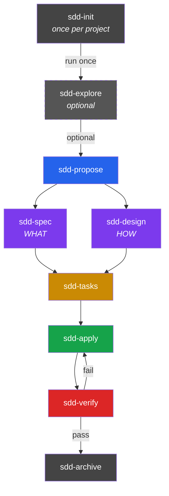

# SDD Guide — When and How to Use Each Phase

## When to Use SDD

SDD is for **substantial changes** — features, APIs, architecture decisions,
multi-file refactors. NOT for every task.

| Task Size | Approach |
|-----------|----------|
| One-line fix, config tweak, typo | Just code it |
| Bug fix (known cause) | Just fix it |
| New feature, API, architecture change | SDD |
| Multi-file refactor with tradeoffs | SDD |
| Unclear requirements, exploration needed | SDD (start with explore) |

## Phase Flow

Key: spec and design run **in parallel** (both depend on proposal, not
on each other). Tasks requires **both**.

## Each Phase

### sdd-init — Project bootstrap (ONCE)

Detects stack, conventions, testing capabilities. Run **once per project**.
The orchestrator auto-runs it if missing (Init Guard). Only re-run when
the project adds/removes test frameworks.

### sdd-explore — Investigate (OPTIONAL)

Research-only. Reads codebase, compares approaches, identifies risks.
No code changes. Skip if you already understand the area deeply.

### sdd-propose — Change proposal (REQUIRED)

Defines intent, scope, approach, risks, rollback plan. This is the
**contract** for everything that follows. Under 450 words.

### sdd-spec — Specifications (WHAT)

Requirements with Given/When/Then scenarios. Uses RFC 2119 keywords
(MUST, SHALL, SHOULD, MAY). Describes WHAT, never HOW. Under 650 words.
Depends on: proposal.

### sdd-design — Technical design (HOW)

Architecture decisions with rationale, file change table, interfaces,
testing strategy. Reads actual codebase before designing. Under 800 words.
Depends on: proposal. Can run in parallel with spec.

### sdd-tasks — Implementation checklist

Concrete, actionable steps grouped by phase. Each task must be specific,
verifiable, and completable in one session. Under 530 words.
Depends on: spec AND design.

### sdd-apply — Write code

Implements tasks following specs and design strictly. Works in batches.
Tracks progress across batches (never overwrites previous progress).
Depends on: tasks + spec + design.

### sdd-verify — Quality gate

Proves implementation matches specs. Runs real tests, not just static
analysis. Produces a spec compliance matrix. A scenario is only COMPLIANT
when a test covering it has PASSED.
Depends on: spec + tasks.

### sdd-archive — Close the change

Merges delta specs into main specs, moves change to archive. NEVER
archive with CRITICAL issues from verify. The archive is an audit trail.
Depends on: all artifacts.

## Meta-Commands (shortcuts)

| Command | Expands to |
|---------|-----------|
| `/sdd-new <name>` | explore + propose |
| `/sdd-continue` | next dependency-ready phase |
| `/sdd-ff <name>` | propose → spec ∥ design → tasks |

These are handled by the orchestrator, not invoked as skills.

## Common Mistakes

1. **Running sdd-init every session** — it runs ONCE. The Init Guard
   handles it automatically.
2. **Using SDD for small tasks** — one-line fixes don't need ceremony.
3. **Skipping verify before archive** — verify is the quality gate.
4. **Running apply without tasks** — the dependency graph is strict.
5. **Partial MODIFIED blocks in specs** — copy the FULL requirement
   block, then edit. Partial blocks lose content at archive time.
6. **Using mem_search preview as content** — always call
   `mem_get_observation(id)` for full untruncated artifacts.

## Artifact Store Modes

| Mode | Storage | Cross-session | Team shareable |
|------|---------|---------------|----------------|
| `engram` | Persistent memory DB | Yes | No |
| `openspec` | `openspec/` files in repo | Via git | Yes |
| `hybrid` | Both | Yes | Yes |
| `none` | Nowhere (ephemeral) | No | No |

Default: `engram` if available, otherwise `none`.
