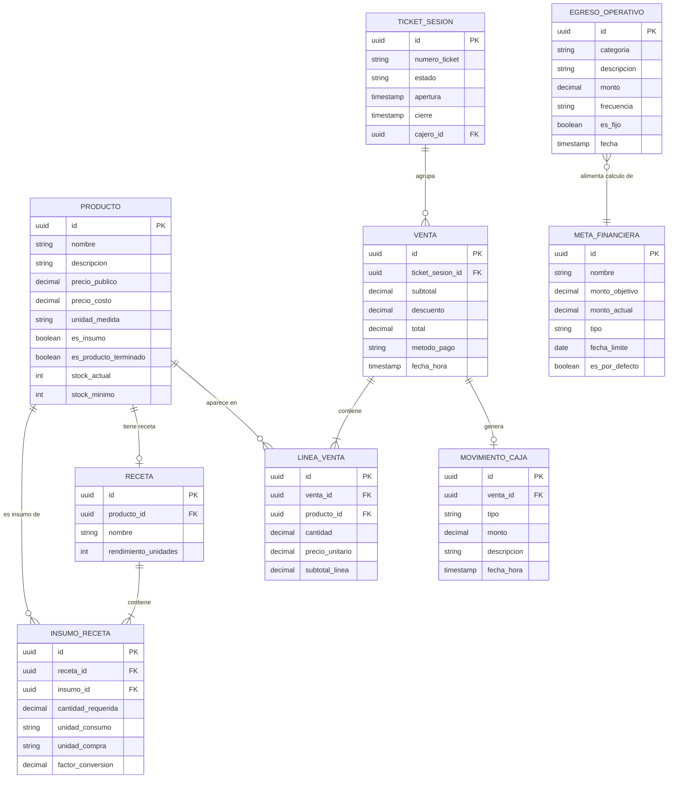
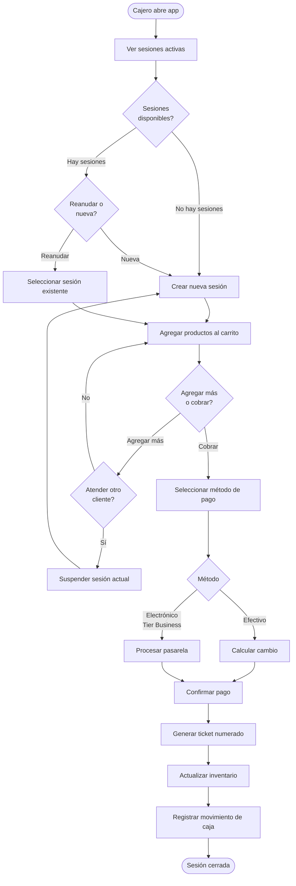
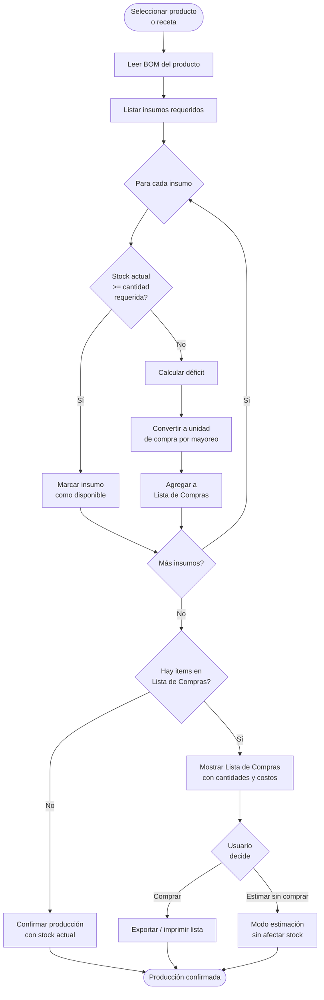
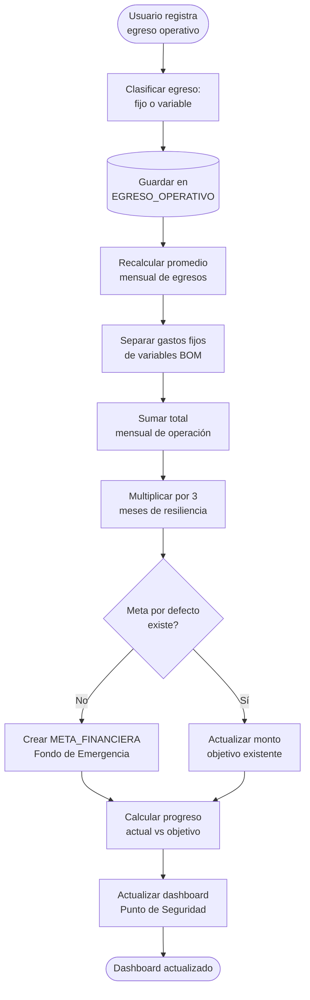
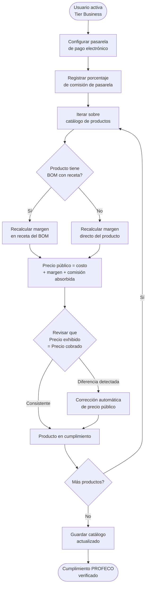

# Formo — Documento de Requerimientos de Producto (PRD)

**Bundle ID:** `mx.virgensystems.formo`

**Stack:** Rust + Dioxus 0.7.5 · Monorepo orquestado por pnpm

**Plataformas V1:** Android · iOS (nativo móvil)

---

## 1. Visión y Propuesta de Valor

Formo es un **Micro-ERP Standalone** diseñado para la formalización elástica de pequeños
negocios en México. No es una app de inventario lineal: es un sistema de transformación de
materiales y gestión de flujo de caja que funciona **100% sin internet**.

El mercado objetivo son negocios informales o semi-formales que necesitan herramientas de
gestión profesional sin depender de conectividad, sin pagar suscripciones hasta que tengan
capacidad, y sin enfrentarse a software diseñado para corporaciones.

### Propuesta de valor diferenciada

- **Offline-first absoluto** — SQLite local, nunca bloquea al usuario por falta de red.
- **BOM dinámico** — transforma recetas en listas de compras automáticas, pensado para
  negocios bajo pedido (pastelerías, cocinas, manufactura artesanal).
- **POS multi-sesión** — atiende varios clientes en paralelo sin perder carritos.
- **Educación financiera integrada** — metas de fondo de emergencia calculadas desde los
  egresos reales del negocio.
- **Cumplimiento PROFECO incorporado** — Art. 7 Bis de la LFPC; precio único, sin
  comisiones visibles al cliente final.

---

## 2. Actores y Roles

| Actor | Descripción | Permisos principales |
|---|---|---|
| **Dueño de negocio** | Propietario o administrador principal | Configuración completa, metas financieras, catálogo, reportes |
| **Empleado / Cajero** | Opera el POS en el punto de venta | POS, consulta de catálogo, cierre de sesión de caja |
| **Cliente final** | Comprador externo | Sin acceso a la app; receptor del ticket de venta |
| **Sistema Banxico (CoDi)** | API externa de pagos | Recibe instrucciones de cobro vía integración de red |
| **Pasarela cripto / Ramp** | API externa de pagos alternativos | Tier Business únicamente |

---

## 3. Modelo de Tiers

La aplicación distribuye el **100% de las funcionalidades en el binario**. Las capacidades
avanzadas se activan exclusivamente mediante paywalls, evitando la descarga de código
externo en tiempo de ejecución (cumplimiento con políticas de App Store / Play Store).

### Tier 1 — Free (Standalone Básico)

- Cobro: **Efectivo únicamente** (cash only).
- Base de datos: SQLite local en el dispositivo.
- Capacidades incluidas:
  - Catálogo de productos con variantes.
  - Almacén lineal (entradas y salidas).
  - POS básico con sesiones paralelas.
  - BOM dinámico y lista de compras.
  - Metas financieras y fondo de emergencia.
  - Cumplimiento PROFECO (precio único).

### Tier 2 — Business (Pago)

- Todo lo del Tier Free, más:
  - **SoftPOS** — Tap to Pay NFC.
  - **CoDi** — integración con API Banxico.
  - **SPEI** — transferencias bancarias.
  - **Cripto** — vía Ramp / API externa.
  - **Sincronización LAN** — multi-dispositivo en red local (próximamente).
  - **Cloud SaaS** — respaldo y sincronización en la nube.

---

## 4. Módulos del Sistema

### 4A. POS Multi-Sesión (Multi-checkout)

A diferencia de los POS básicos, Formo permite mantener múltiples tickets o ventas activas
de forma simultánea.

**Caso de uso principal:** el cajero puede iniciar la venta de un cliente que está
contando monedas o esperando confirmación de pago, mientras comienza a registrar los
artículos del siguiente cliente en la fila, sin perder ninguno de los dos carritos.

**Requerimientos funcionales:**

- Crear, suspender y reanudar sesiones de venta de forma independiente.
- Switch de sesiones desde la UI sin pérdida de datos del carrito activo.
- Cada sesión mantiene su propio subtotal, descuentos y método de pago seleccionado.
- Cierre de sesión genera un ticket numerado y actualiza el inventario atómicamente.

### 4B. BOM Dinámico y Procurement List

El motor de **Bill of Materials (BOM)** no solo deduce existencias: sirve como herramienta
de planeación para negocios bajo pedido.

**Requerimientos funcionales:**

- **Explosión de insumos:** al seleccionar un producto/receta, el sistema verifica el
  stock disponible de cada insumo.
- **Generación automática de Lista de Compras:** si los insumos son insuficientes o
  inexistentes, el sistema genera la lista con las cantidades exactas necesarias.
- **Conversión de unidades:** maneja automáticamente la diferencia entre unidad de compra
  por mayoreo (ej. bulto de 25 kg de harina) y unidad de consumo por receta (ej. 250 g).
- **Modo Estimación:** permite planear la producción antes de comprometer stock.

### 4C. Metas Financieras y Resiliencia Operativa

El registro de **Egresos Operativos** sirve como base para educar financieramente al dueño
del negocio y calcular su nivel de resiliencia.

**Requerimientos funcionales:**

- **Meta por defecto — Fondo de Emergencia:** Formo sugiere automáticamente una meta de
  ahorro equivalente a **3 meses de operación**.
- **Cálculo inteligente:** la app distingue gastos fijos (renta, servicios) de variables
  (insumos del BOM) para determinar el monto mensual necesario.
- **Dashboard de progreso:** el tablero principal muestra qué tan cerca está el negocio de
  alcanzar su Punto de Seguridad financiero.
- **Metas personalizadas:** el dueño puede definir metas adicionales (expansión, equipo,
  etc.) con montos y plazos propios.

### 4D. Catálogo y Almacén

Base de productos e insumos que alimenta tanto el POS como el BOM.

**Requerimientos funcionales:**

- Alta, modificación y baja de productos terminados e insumos.
- Soporte para variantes de producto (talla, color, sabor).
- Control de stock con alertas de mínimo configurable.
- Historial de movimientos de almacén (entradas, salidas, ajustes manuales).
- Precios de costo y precio público por producto.

### 4E. Cumplimiento Legal (PROFECO Art. 7 Bis)

La **Ley Federal de Protección al Consumidor**, artículo 7 Bis, prohíbe agregar cargos
adicionales al precio exhibido al momento del cobro con tarjeta u otro método electrónico.

**Requerimientos funcionales:**

- **Precio único:** el sistema no permite agregar "comisión por tarjeta" como cargo
  separado en el ticket.
- **Ajuste automatizado de márgenes:** si el usuario activa el Tier Business (pagos
  electrónicos), el sistema recalcula los márgenes dentro del BOM para que el **Precio
  Público exhibido** ya absorba el costo de la transacción bancaria.
- **Transparencia total:** el cliente siempre ve y paga un único precio; el costo de la
  pasarela es absorbido internamente por el negocio vía ajuste de margen.

---

## 5. Modelo de Dominio

---

## 6. Flujos Principales

### 6.1 Flujo de venta POS con sesiones paralelas

### 6.2 Explosión de BOM y generación de lista de compras

### 6.3 Cálculo automático de meta de fondo de emergencia

### 6.4 Ajuste de precios por cumplimiento PROFECO

---

## 7. Requerimientos No Funcionales

### 7.1 Offline-First

- La UI (Dioxus) lee **siempre** de SQLite local. Ninguna operación de venta o inventario
  bloquea esperando red.
- La lógica de red (sincronización Cloud / LAN) opera como proceso de fondo no bloqueante.
- El usuario nunca verá un estado de error por falta de conectividad durante una venta.

### 7.2 Rendimiento

- Apertura de sesión de venta: < 300 ms desde tap hasta carrito activo.
- Búsqueda en catálogo: < 100 ms para catálogos de hasta 10 000 SKUs.
- Cierre de ticket y actualización de inventario: operación atómica < 500 ms.
- Generación de lista de compras (explosión BOM): < 1 s para recetas con hasta 50 insumos.

### 7.3 Plataforma

- **Android:** API 26+ (Android 8.0 Oreo en adelante).
- **iOS:** iOS 16+.
- **Idioma:** español mexicano (es-MX) como idioma único en V1.
- **Almacenamiento mínimo:** < 50 MB de instalación base.

### 7.4 Seguridad y Privacidad

- Todos los datos del negocio residen exclusivamente en el dispositivo (Tier Free).
- No se recopilan datos de uso ni telemetría sin consentimiento explícito del usuario.
- El respaldo Cloud (Tier Business) usa cifrado en tránsito (TLS 1.3) y en reposo (AES-256).

---

## 8. Decisiones de Ingeniería

Las decisiones arquitectónicas de implementación se documentan en ADRs separados bajo
`docs/adr/`. Esta sección referencia las decisiones clave que dan forma al producto.

### ADR-001 — Pipeline de calidad pixel-perfect agnóstico al framework

[`docs/adr/adr-001-framework-agnostic-pixel-perfect-quality-pipeline.md`](adr/adr-001-framework-agnostic-pixel-perfect-quality-pipeline.md)

Establece la estrategia de validación visual y calidad de UI independientemente del
framework de renderizado. Aplica a la capa de UI en Dioxus y al pipeline de CI local.

### ADR-002 — Arquitectura standalone-first offline

[`docs/adr/adr-002-standalone-first-offline-architecture.md`](adr/adr-002-standalone-first-offline-architecture.md)

Justifica SQLite como única fuente de verdad en el dispositivo y la ausencia de dependencia
de red para cualquier operación crítica del negocio. Fundamento del Tier Free.

### ADR-003 — Freemium: todas las features en el binario

[`docs/adr/adr-003-freemium-all-features-in-binary.md`](adr/adr-003-freemium-all-features-in-binary.md)

Documenta la decisión de distribuir el 100% del código en el binario instalado y activar
capacidades avanzadas vía paywalls internos, en conformidad con las políticas de App Store
y Play Store sobre descarga de código ejecutable en runtime.

### ADR-004 — Cumplimiento automático de precios PROFECO

[`docs/adr/adr-004-profeco-automatic-price-compliance.md`](adr/adr-004-profeco-automatic-price-compliance.md)

Define el mecanismo de recálculo automático de márgenes en el BOM al activar pagos
electrónicos, garantizando precio único conforme al Art. 7 Bis de la LFPC sin intervención
manual del dueño del negocio.

### ADR-005 — Dioxus mobile Rust WebView

[`docs/adr/adr-005-dioxus-mobile-rust-webview.md`](adr/adr-005-dioxus-mobile-rust-webview.md)

Justifica la elección de Rust + Dioxus 0.7.5 como stack mobile frente a alternativas
(Flutter, React Native, Kotlin/Swift nativo). Cubre rendimiento, distribución de binario,
y capacidad offline-first.

---

## 9. Épicas y Stories

### Épica 1 — Catálogo y Almacén

#### Story 1.1: El dueño da de alta un producto terminado

- [ ] Definir esquema de entidad `PRODUCTO`
- [ ] Implementar formulario de alta con campos requeridos y opcionales
- [ ] Implementar validación de campos (nombre único, precio > 0)
- [ ] Persistir en SQLite local

#### Story 1.2: El dueño da de alta un insumo con unidad de compra y consumo

- [ ] Extender modelo `PRODUCTO` con flag `es_insumo`
- [ ] Implementar campo de unidad de compra (mayoreo) y unidad de consumo (receta)
- [ ] Implementar campo de factor de conversión con validación numérica

#### Story 1.3: El dueño configura stock mínimo y recibe alerta

- [ ] Implementar campo `stock_minimo` en `PRODUCTO`
- [ ] Implementar lógica de evaluación de alerta al registrar salida de stock
- [ ] Mostrar indicador visual en catálogo cuando stock < mínimo

---

### Épica 2 — BOM Dinámico y Procurement List

#### Story 2.1: El dueño crea una receta (BOM) para un producto

- [ ] Definir esquemas `RECETA` e `INSUMO_RECETA`
- [ ] Implementar editor de receta con líneas de insumos + cantidades
- [ ] Implementar conversión automática de unidades en `INSUMO_RECETA`

#### Story 2.2: El cajero genera una lista de compras desde una receta

- [ ] Implementar motor de explosión BOM (consulta stock vs requerido)
- [ ] Calcular déficit por insumo con conversión a unidad de compra por mayoreo
- [ ] Generar y mostrar lista de compras con cantidades y costos estimados
- [ ] Implementar opción de exportar / imprimir lista

#### Story 2.3: El dueño usa el modo estimación sin comprometer stock

- [ ] Implementar flag de modo estimación en la explosión BOM
- [ ] Asegurar que el modo estimación no modifica `stock_actual`

---

### Épica 3 — POS Multi-Sesión

#### Story 3.1: El cajero crea y gestiona sesiones paralelas de venta

- [ ] Definir esquema `TICKET_SESION`
- [ ] Implementar creación de nueva sesión con ID y timestamp
- [ ] Implementar switch de sesiones desde la barra de navegación del POS
- [ ] Garantizar persistencia del carrito al suspender una sesión

#### Story 3.2: El cajero cobra y cierra una sesión de venta

- [ ] Definir esquemas `VENTA`, `LINEA_VENTA` y `MOVIMIENTO_CAJA`
- [ ] Implementar flujo de cobro en efectivo con cálculo de cambio
- [ ] Implementar actualización atómica de inventario al cerrar sesión
- [ ] Generar ticket numerado con detalle de la venta

#### Story 3.3 (Tier Business): El cajero cobra con pago electrónico

- [ ] Integrar SoftPOS / NFC para Tap to Pay
- [ ] Integrar API CoDi (Banxico)
- [ ] Integrar SPEI
- [ ] Integrar Ramp para cripto
- [ ] Validar que ningún método agrega comisión visible al ticket

---

### Épica 4 — Metas Financieras y Resiliencia Operativa

#### Story 4.1: El dueño registra egresos operativos del negocio

- [ ] Definir esquema `EGRESO_OPERATIVO` con categoría y frecuencia
- [ ] Implementar formulario de registro de egreso
- [ ] Clasificar egresos como fijos o variables automáticamente por categoría

#### Story 4.2: El sistema sugiere la meta de fondo de emergencia

- [ ] Implementar cálculo de promedio mensual de egresos
- [ ] Implementar creación automática de `META_FINANCIERA` tipo fondo de emergencia
- [ ] Calcular monto objetivo = promedio mensual × 3

#### Story 4.3: El dueño visualiza su Punto de Seguridad en el dashboard

- [ ] Implementar widget de progreso de meta en pantalla principal
- [ ] Calcular porcentaje de avance sobre monto objetivo
- [ ] Actualizar progreso en tiempo real al registrar nuevos egresos o ingresos

---

### Épica 5 — Cumplimiento PROFECO

#### Story 5.1: El sistema aplica precio único en el ticket (sin comisiones visibles)

- [ ] Implementar validación en cierre de venta: precio cobrado = precio exhibido
- [ ] Bloquear cualquier campo de "recargo por pago electrónico" en el ticket

#### Story 5.2 (Tier Business): El sistema recalcula márgenes al activar pagos electrónicos

- [ ] Implementar flujo de configuración de pasarela con porcentaje de comisión
- [ ] Implementar recálculo de precio público en catálogo al activar Tier Business
- [ ] Implementar verificación de consistencia precio exhibido vs precio cobrado

---

### Épica 6 — Infraestructura y CI

#### Story 6.1: El equipo ejecuta el gate de calidad local con un solo comando

- [ ] Configurar `pnpm run test` como punto de entrada unificado
- [ ] Integrar tests unitarios Rust (`cargo test`)
- [ ] Integrar Maestro smoke tests para flujos críticos iOS/Android
- [ ] Documentar requisitos del entorno local en `AGENTS.md`
