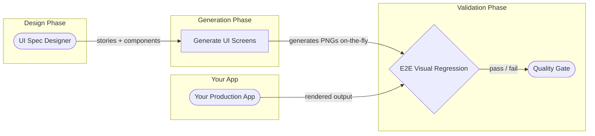
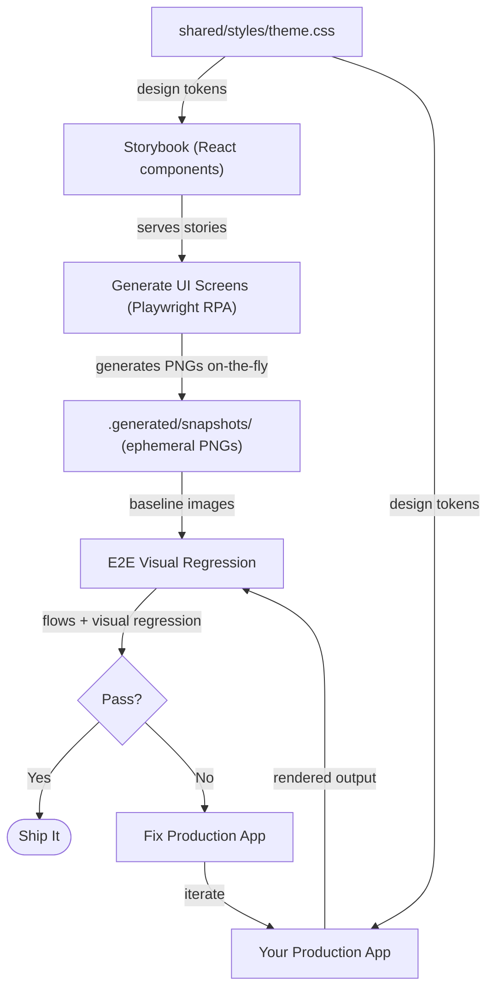
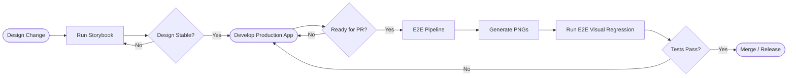
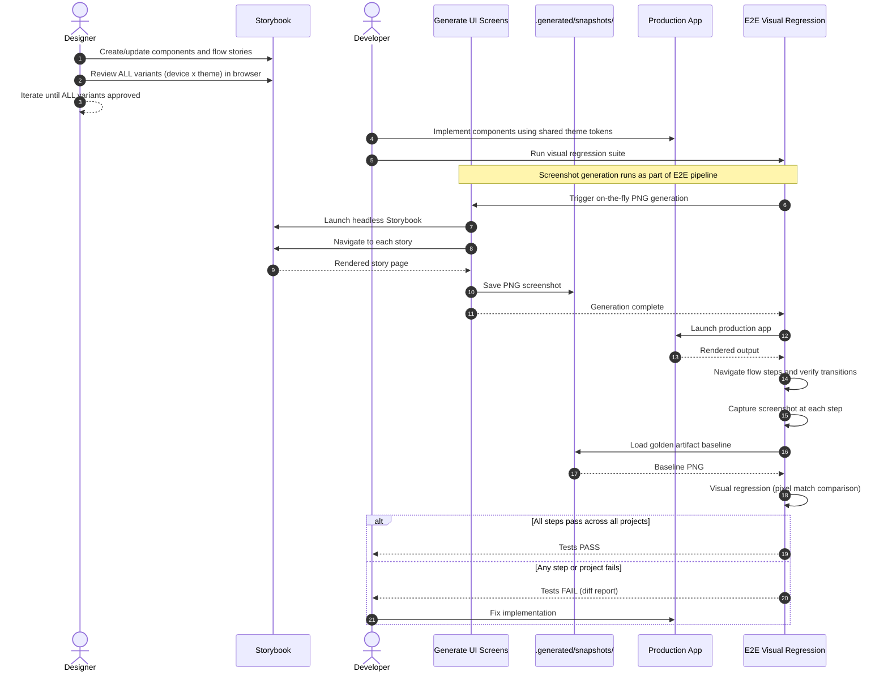
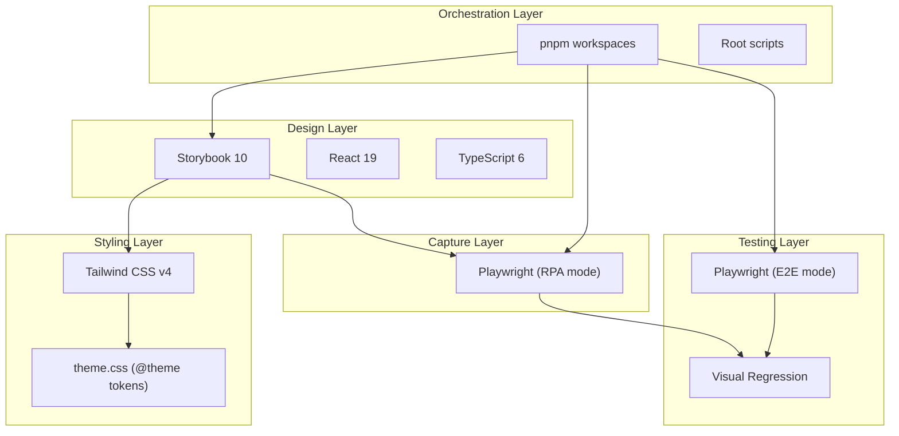

# Architecture -- Cross UI Template

> **Docs:** [README](../README.md) | [AGENTS.md](../AGENTS.md) | **Architecture** | [Pipeline](feature-validation-pipeline.md) | [ADRs](adr/) | [CLAUDE.md](../CLAUDE.md) | [Changelog](../CHANGELOG.md)

## Table of Contents

- [Overview](#overview)
- [App Pipeline](#app-pipeline)
- [Template Usage](#template-usage)
- [Data Flow](#data-flow)
- [Execution Frequency](#execution-frequency)
- [Flow-as-Story Pattern](#flow-as-story-pattern)
- [Monorepo Structure](#monorepo-structure)
- [Quality Pipeline Sequence](#quality-pipeline-sequence)
- [Architectural Decisions](#architectural-decisions)
- [Technology Stack](#technology-stack)

## Overview

Cross UI Template is a reusable monorepo template that provides a 3-app visual quality pipeline.
The core idea: **visual specification (Storybook) serves as the single source of truth for UI
design**. Golden artifacts (PNG screenshots) are generated on-the-fly from those specs, and any
production app is validated against them via E2E visual regression.

This template is technology-agnostic on the production side. You bring your own production app
(Dioxus, Next.js, SvelteKit, Flutter -- whatever renders UI) and the pipeline validates it
against the visual specification.

The architecture enforces a disciplined 3-process pipeline:

1. **P1: Visual Specification** -- design what it should look like (Storybook), with human
   approval across all device x theme variants
2. **P2: Reference Screenshots** -- generate the visual contract on-the-fly (golden artifact
   PNGs to `.generated/snapshots/`)
3. **P3: E2E Visual Regression** -- verify navigation flows, screen transitions, and visual
   accuracy via pixel match threshold

For the complete pipeline specification including the flow-as-story pattern and coverage
validation, see [Feature Validation Pipeline](feature-validation-pipeline.md).

The shared Tailwind v4 theme ensures the design tool (React/Storybook) and the production app
use identical design tokens -- colors, typography, spacing, and radii.

[Back to top](#table-of-contents)

## App Pipeline



### App 1 -- UI Spec Designer (Storybook)

- **Purpose**: Independent visual source of truth
- **What it does**: All screens and components are designed here first as React components
  with Storybook stories
- **Produces**: Visual molds (React components + stories)
- **Tech**: Storybook 10, React 19, TypeScript 6, Tailwind CSS v4
- **Location**: `apps/ui-spec-designer/`
- **Package**: `@cross-ui/ui-spec-designer`

### App 2 -- Generate UI Screens (Playwright RPA)

- **Purpose**: Generate the visual contract as device-agnostic artifacts on-the-fly
- **What it does**: Launches Storybook in headless mode, navigates every story, captures PNG
  screenshots to `.generated/snapshots/` (gitignored)
- **Produces**: Golden artifact PNGs (ephemeral, regenerated before each E2E run)
- **When to run**: Automatically as part of the E2E pipeline -- runs before visual regression tests
- **Tech**: Playwright (RPA mode), TypeScript
- **Location**: `apps/generate-ui-screens/`
- **Package**: `@cross-ui/generate-ui-screens`

### App 3 -- E2E Visual Regression (Playwright)

- **Purpose**: Verify navigation flows, screen transitions, and visual accuracy against the
  Storybook golden artifacts
- **What it does**: Runs the screenshot generator first to produce fresh baselines, then launches
  the production app, executes flow-based integration tests, and validates visual output via
  pixel-diff comparison
- **Test structure**: One test file per flow -- tests are device-agnostic and theme-agnostic.
  The project matrix in `playwright.config.ts` multiplies each test across all variants
- **Baselines**: Reads from `.generated/snapshots/` (produced by generate-ui-screens in the
  same pipeline run)
- **Tech**: Playwright (E2E mode), TypeScript
- **Location**: `apps/e2e/`
- **Package**: `@cross-ui/e2e`

[Back to top](#table-of-contents)

## Template Usage

This is a template repository. To use it:

1. **Clone** the template into your project
2. **Run `pnpm run init`** to personalize the `@cross-ui/` scope and project name
3. **Design** your UI in Storybook (`apps/ui-spec-designer/`)
4. **Build** your production app (add it to the monorepo or point E2E tests at an external URL)
5. **Validate** by running `pnpm run pipeline:full`

The pipeline is production-app agnostic. Configure `apps/e2e/playwright.config.ts` to point at
your production app's URL and define the project matrix (devices, themes) that match your targets.

[Back to top](#table-of-contents)

## Data Flow



[Back to top](#table-of-contents)

## Execution Frequency

Each app runs at a different cadence. Understanding when to run each one prevents wasted
cycles and keeps the pipeline efficient.

| App | When to Run | Trigger | Frequency |
|-----|------------|---------|-----------|
| ui-spec-designer | During design phase | Developer starts manually | On-demand |
| generate-ui-screens | As part of E2E pipeline | Runs automatically before E2E tests | Per PR / release |
| e2e | Before merge/release | CI/CD pipeline or on-demand | Per PR / release |



[Back to top](#table-of-contents)

## Flow-as-Story Pattern

Flows define the navigation sequences a user will experience in the production application.
They are defined AS Storybook stories under the `Flows/` title hierarchy, with an explicit
step order declared via `parameters.flow.steps`.

This pattern provides:

- **Type safety**: each flow step renders a real component -- if a component is deleted or
  renamed, TypeScript breaks immediately
- **Automatic discovery**: the RPA and E2E pipelines discover flows via Storybook's `index.json`
- **Human approval**: each flow variant (device x theme) goes through the same approval loop
  as individual screens

For the full flow specification and code examples, see
[Feature Validation Pipeline](feature-validation-pipeline.md#flow-definition).

[Back to top](#table-of-contents)

## Monorepo Structure

```text
cross-ui-template/
├── apps/
│   ├── ui-spec-designer/             # Storybook 10 (design source of truth)
│   │   ├── .storybook/
│   │   │   ├── main.ts
│   │   │   └── preview.ts
│   │   └── src/
│   │       └── components/
│   │           └── Button/
│   │               ├── Button.tsx
│   │               └── Button.stories.tsx
│   ├── generate-ui-screens/          # Playwright RPA (generate golden PNGs on-the-fly)
│   ├── e2e/                          # Playwright E2E (visual regression)
│   └── web/                          # Placeholder production app (replace with your own)
├── shared/
│   ├── package.json
│   └── styles/
│       └── theme.css                 # Tailwind v4 design tokens (@theme)
├── .generated/                       # Unified artifact output (gitignored)
│   ├── snapshots/{project}/{flow}/   # Golden PNGs (RPA capture, generated on-the-fly)
│   └── reports/
│       ├── e2e/                      # E2E Playwright HTML report
│       ├── e2e-diffs/{project}/{flow}/  # Visual regression diffs
│       ├── capture/                  # generate-ui-screens Playwright report
│       └── storybook-static/         # Storybook build output
├── docs/
│   ├── architecture.md               # This file
│   ├── feature-validation-pipeline.md  # Full pipeline spec (flows, matrix, coverage)
│   └── adr/
│       └── adr-001-framework-agnostic-pixel-perfect-quality-pipeline.md
├── scripts/
│   └── init.sh                       # Template personalization script (bash, self-deleting)
├── pnpm-workspace.yaml               # Workspace: apps/* + shared/*
└── package.json                      # Root orchestrator (pnpm scripts)
```

[Back to top](#table-of-contents)

## Quality Pipeline Sequence



[Back to top](#table-of-contents)

## Architectural Decisions

All architectural decisions are captured in a single foundational ADR:

- [ADR-001](adr/adr-001-framework-agnostic-pixel-perfect-quality-pipeline.md) -- Framework-agnostic
  pixel-perfect quality pipeline

[Back to top](#table-of-contents)

## Technology Stack



| Layer | Technology | Purpose |
|-------|-----------|---------|
| Design | Storybook 10, React 19, TypeScript 6 | Visual specification of all UI components |
| Styling | Tailwind CSS v4 (CSS-first, shared theme) | Design token contract between apps |
| Capture | Playwright (RPA mode) | Headless screenshot generation |
| Testing | Playwright (E2E mode) | Visual regression against production app |
| Orchestration | pnpm workspaces, root scripts | Monorepo task coordination |

[Back to top](#table-of-contents)
