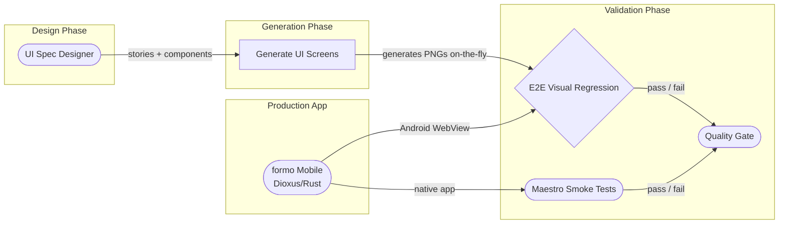
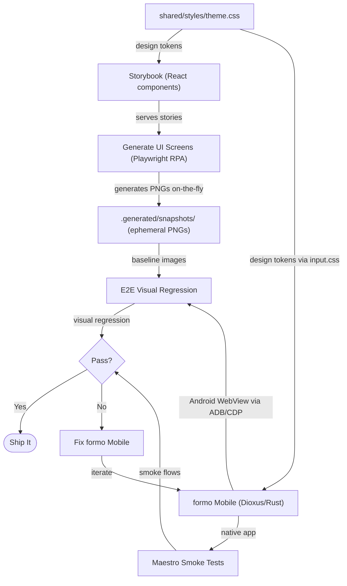
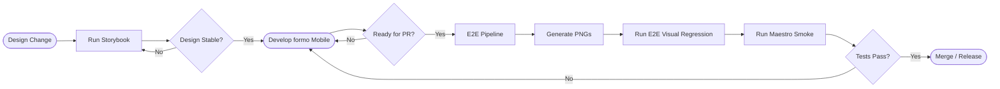
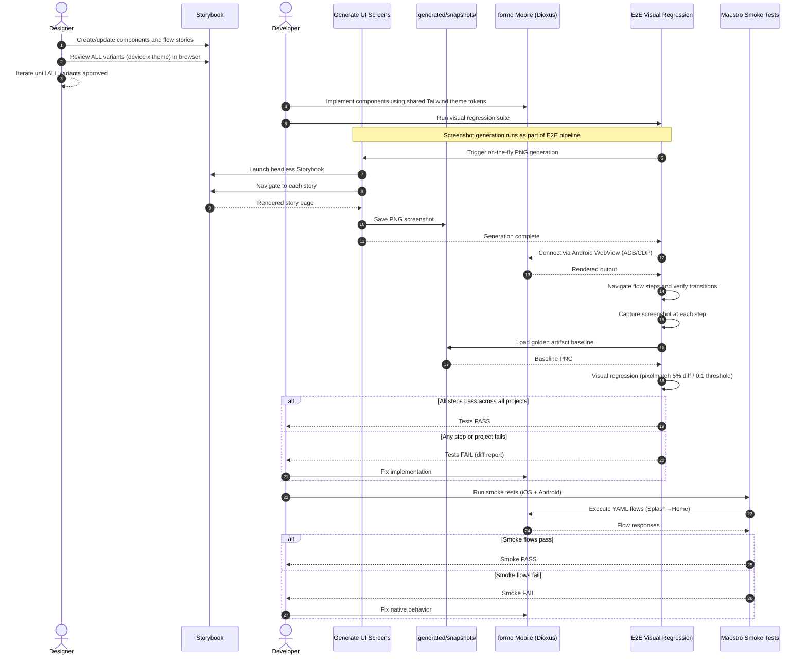
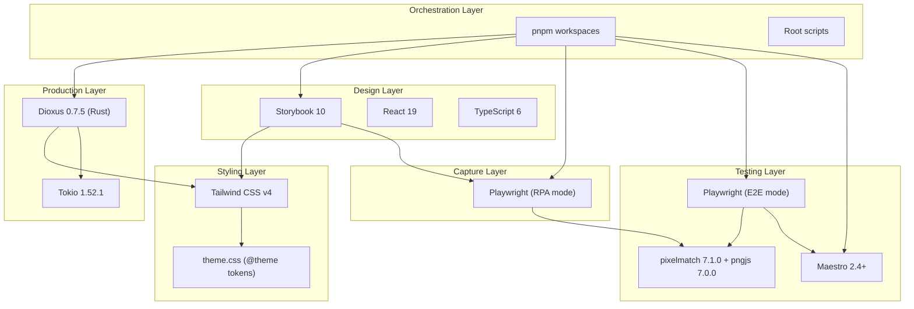

# Architecture -- formo

> **Docs:** [README](../README.md) | [AGENTS.md](../AGENTS.md) | **Architecture** | [Pipeline](feature-validation-pipeline.md) | [ADRs](adr/) | [CLAUDE.md](../CLAUDE.md) | [Changelog](../CHANGELOG.md)

## Table of Contents

- [Overview](#overview)
- [App Pipeline](#app-pipeline)
- [Data Flow](#data-flow)
- [Execution Frequency](#execution-frequency)
- [Flow-as-Story Pattern](#flow-as-story-pattern)
- [Monorepo Structure](#monorepo-structure)
- [Quality Pipeline Sequence](#quality-pipeline-sequence)
- [Architectural Decisions](#architectural-decisions)
- [Technology Stack](#technology-stack)

## Overview

formo is a Rust/Dioxus mobile application (Android + iOS) with a 5-app visual quality pipeline.
The core idea: **visual specification (Storybook) serves as the single source of truth for UI
design**. Golden artifacts (PNG screenshots) are generated on-the-fly from those specs, and the
production app is validated against them via E2E visual regression plus native smoke tests.

The architecture enforces a disciplined pipeline:

1. **P1: Visual Specification** -- design what it should look like (Storybook), with human
   approval across all device x theme variants
2. **P2: Reference Screenshots** -- generate the visual contract on-the-fly (golden artifact
   PNGs to `.generated/snapshots/`)
3. **P3: E2E Visual Regression** -- verify navigation flows, screen transitions, and visual
   accuracy via pixel match threshold against the Android WebView
4. **P4: Smoke Tests** -- validate native iOS and Android flows with Maestro

The shared Tailwind v4 theme ensures the design tool (React/Storybook) and the Dioxus mobile app
use identical design tokens -- colors, typography, spacing, and radii.

For the complete pipeline specification including the flow-as-story pattern and coverage
validation, see [Feature Validation Pipeline](feature-validation-pipeline.md).

[Back to top](#table-of-contents)

## App Pipeline



### App 1 -- UI Spec Designer (Storybook)

- **Purpose**: Independent visual source of truth
- **What it does**: All screens and components are designed here first as React components
  with Storybook stories
- **Produces**: Visual molds (React components + stories)
- **Tech**: Storybook 10.3.5, React 19.2.5, TypeScript 6.0.2, Tailwind CSS v4
- **Location**: `apps/ui-spec-designer/`
- **Package**: `@formo/ui-spec-designer`

### App 2 -- Generate UI Screens (Playwright RPA)

- **Purpose**: Generate the visual contract as device-agnostic artifacts on-the-fly
- **What it does**: Launches Storybook in headless mode, navigates every story, captures PNG
  screenshots to `.generated/snapshots/` (gitignored)
- **Produces**: Golden artifact PNGs (ephemeral, regenerated before each E2E run)
- **When to run**: Automatically as part of the E2E pipeline -- runs before visual regression tests
- **Tech**: Playwright 1.52.0 (RPA mode), TypeScript
- **Location**: `apps/generate-ui-screens/`
- **Package**: `@formo/generate-ui-screens`

### App 3 -- E2E Visual Regression (Playwright)

- **Purpose**: Verify navigation flows, screen transitions, and visual accuracy against the
  Storybook golden artifacts
- **What it does**: Runs the screenshot generator first to produce fresh baselines, then connects
  to the Android WebView via Playwright `_android` experimental API (ADB/CDP), executes
  flow-based integration tests, and validates visual output via pixel-diff comparison
- **Test structure**: One test file per flow -- tests are device-agnostic and theme-agnostic.
  The project matrix in `playwright.config.ts` multiplies each test across all variants
- **Baselines**: Reads from `.generated/snapshots/` (produced by generate-ui-screens in the
  same pipeline run)
- **Visual comparison**: Custom runner `run-e2e.ts` using pixelmatch 7.1.0 + pngjs 7.0.0,
  5% diff threshold, 0.1 pixelmatch threshold. Viewport and DPR are matched -- no resize needed
- **Tech**: Playwright 1.52.0 (E2E mode), TypeScript
- **Location**: `apps/e2e/`
- **Package**: `@formo/e2e`

### App 4 -- E2E Maestro Smoke Tests

- **Purpose**: Validate critical native flows on real iOS and Android devices
- **What it does**: Runs YAML-defined Maestro flows against the installed formo app to verify
  the core splash-to-home navigation path
- **Scope**: Smoke-only -- covers the happy path; visual regression is handled by App 3
- **Tech**: Maestro 2.4+
- **Location**: `apps/e2e-maestro-smoke/`
- **Package**: `@formo/e2e-maestro-smoke`

### App 5 -- formo Mobile (Dioxus/Rust)

- **Purpose**: The production application
- **What it does**: Router-based mobile app (Splash → Home flow) targeting Android API 33+
  and iOS 16.0+
- **Tech**: Dioxus 0.7.5 (Rust edition 2024), Tokio 1.52.1 (async effects), Tailwind CSS v4
- **Bundle ID**: `mx.virgensystems.formo`
- **Platform notes**: Android API 33+ required (Tailwind v4 `@layer` needs Chrome 99+);
  iOS 16.0+ required
- **Eco-scripts**: `lint` → `cargo clippy`, `format:check` → `cargo fmt --check`,
  `type-check` → `cargo check` (same script names as JS apps)
- **Location**: `apps/mobile/`

[Back to top](#table-of-contents)

## Data Flow



[Back to top](#table-of-contents)

## Execution Frequency

Each app runs at a different cadence. Understanding when to run each one prevents wasted
cycles and keeps the pipeline efficient.

| App                  | When to Run             | Trigger                             | Frequency        |
| -------------------- | ----------------------- | ----------------------------------- | ---------------- |
| ui-spec-designer     | During design phase     | Developer starts manually           | On-demand        |
| generate-ui-screens  | As part of E2E pipeline | Runs automatically before E2E tests | Per PR / release |
| e2e                  | Before merge/release    | CI/CD pipeline or on-demand         | Per PR / release |
| e2e-maestro-smoke    | Before merge/release    | CI/CD pipeline or on-demand         | Per PR / release |
| mobile               | During development      | Developer builds/runs locally       | Continuous       |



[Back to top](#table-of-contents)

## Flow-as-Story Pattern

Flows define the navigation sequences a user will experience in formo. They are defined AS
Storybook stories under the `Flows/` title hierarchy, with an explicit step order declared via
`parameters.flow.steps`.

This pattern provides:

- **Type safety**: each flow step renders a real component -- if a component is deleted or
  renamed, TypeScript breaks immediately
- **Automatic discovery**: the RPA and E2E pipelines discover flows via Storybook's `index.json`
- **Human approval**: each flow variant (device x theme) goes through the same approval loop
  as individual screens

For the full flow specification and code examples, see
[Feature Validation Pipeline](feature-validation-pipeline.md#flow-definition).

[Back to top](#table-of-contents)

## Monorepo Structure

```text
formo/
├── apps/
│   ├── ui-spec-designer/             # Storybook 10 (design source of truth)
│   │   ├── .storybook/
│   │   │   ├── main.ts
│   │   │   └── preview.ts
│   │   └── src/
│   │       └── components/
│   ├── generate-ui-screens/          # Playwright RPA (generate golden PNGs on-the-fly)
│   ├── e2e/                          # Custom Playwright runner (visual regression)
│   ├── e2e-maestro-smoke/            # Maestro 2.4+ (iOS + Android smoke tests)
│   └── mobile/                       # Dioxus 0.7.5 (Rust, Android + iOS)
│       ├── Cargo.toml
│       ├── Dioxus.toml
│       ├── package.json              # Eco scripts (lint→clippy, format→cargo fmt)
│       ├── input.css                 # Tailwind entry (imports shared theme)
│       └── src/main.rs               # Router-based app (Splash→Home flow)
├── shared/
│   └── styles/theme.css              # Tailwind v4 design tokens (@theme)
├── .generated/                       # Unified artifact output (gitignored)
│   ├── snapshots/{variant}/{flow}/   # Golden PNGs
│   └── reports/
│       ├── e2e/                      # E2E HTML report
│       ├── e2e-diffs/                # Visual regression diffs
│       ├── capture/                  # RPA capture report
│       └── storybook-static/         # Storybook build
├── docs/
│   ├── architecture.md               # This file
│   ├── feature-validation-pipeline.md
│   ├── BUSINESS_SPEC.md              # Product requirements
│   └── adr/
└── package.json                      # Root orchestrator
```

[Back to top](#table-of-contents)

## Quality Pipeline Sequence



[Back to top](#table-of-contents)

## Architectural Decisions

All architectural decisions are captured as ADRs:

- [ADR-001](adr/adr-001-framework-agnostic-pixel-perfect-quality-pipeline.md) -- Framework-agnostic
  pixel-perfect quality pipeline
- [ADR-002](adr/adr-002-standalone-first-offline-architecture.md) -- Standalone-first offline
  architecture with SQLite
- [ADR-003](adr/adr-003-freemium-all-features-in-binary.md) -- Freemium with all features
  compiled in binary
- [ADR-004](adr/adr-004-profeco-automatic-price-compliance.md) -- PROFECO Art. 7 Bis automatic
  price compliance
- [ADR-005](adr/adr-005-dioxus-mobile-rust-webview.md) -- Dioxus 0.7 for mobile (Rust + WebView)

[Back to top](#table-of-contents)

## Technology Stack



| Layer          | Technology                                       | Purpose                              |
| -------------- | ------------------------------------------------ | ------------------------------------ |
| Production App | Dioxus 0.7.5, Rust (edition 2024), Tokio 1.52.1 | Mobile app (Android + iOS)           |
| Design         | Storybook 10.3.5, React 19.2.5, TypeScript 6.0.2 | Visual specification                |
| Styling        | Tailwind CSS 4.2.2 (CSS-first, shared @theme)   | Design token contract                |
| RPA Capture    | Playwright 1.52.0 (library mode)                | Golden PNG generation                |
| E2E Visual     | Custom runner + pixelmatch 7.1.0 + pngjs 7.0.0  | Android WebView regression           |
| Smoke Tests    | Maestro 2.4+                                    | Native iOS + Android flows           |
| Quality        | ESLint 10, Prettier, cargo clippy, cargo fmt    | Code quality                         |
| Orchestration  | pnpm 10.33.0 workspaces                         | Monorepo coordination                |

[Back to top](#table-of-contents)
