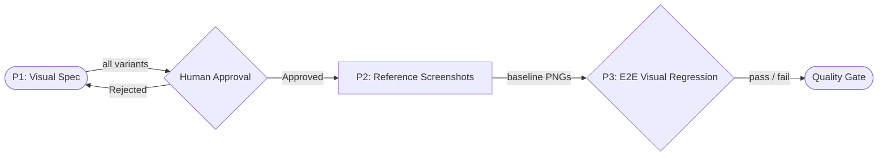
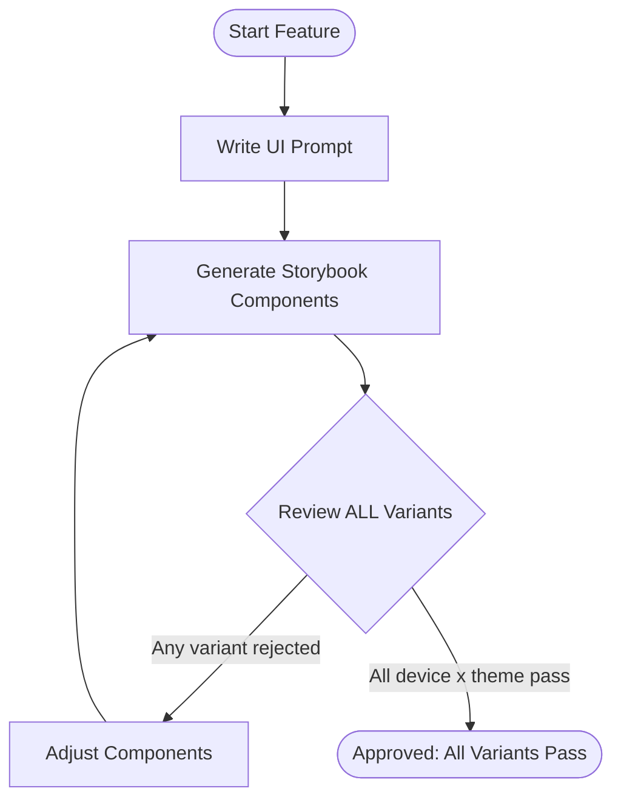
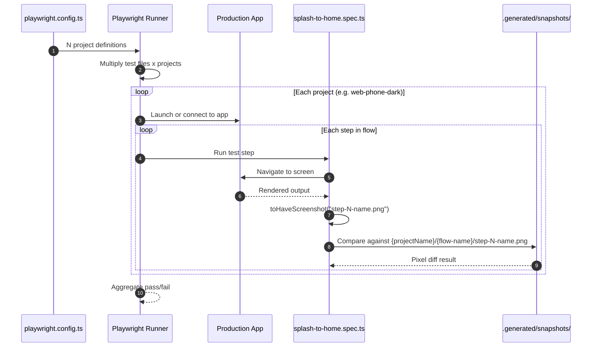
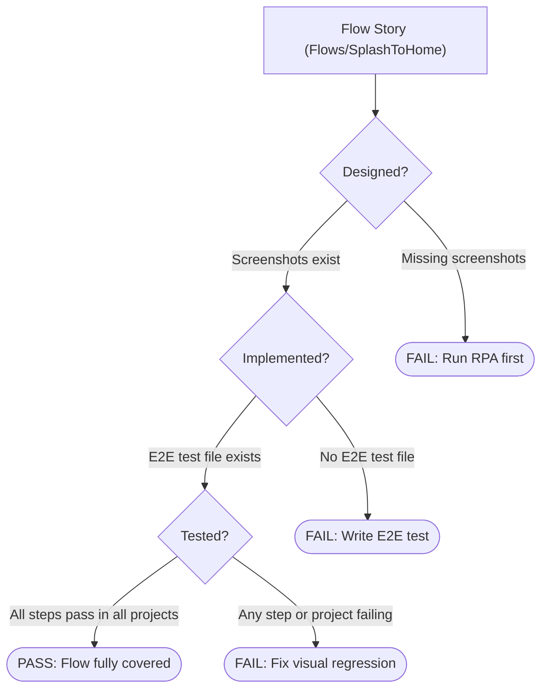
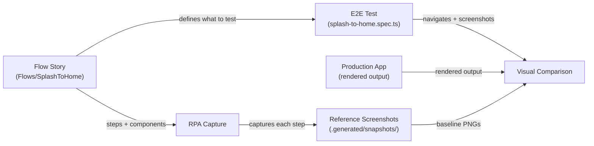

# Feature Validation Pipeline

> **Docs:** [README](../README.md) | [AGENTS.md](../AGENTS.md) | [Architecture](architecture.md) | **Pipeline** | [ADRs](adr/) | [CLAUDE.md](../CLAUDE.md) | [Changelog](../CHANGELOG.md)

## Table of Contents

- [Overview](#overview)
- [Process 1: Visual Specification (Storybook)](#process-1-visual-specification-storybook)
- [Flow Definition](#flow-definition)
- [Process 2: Reference Screenshot Generation (RPA)](#process-2-reference-screenshot-generation-rpa)
- [Process 3: E2E Visual Regression](#process-3-e2e-visual-regression)
- [Coverage Validation](#coverage-validation)

## Overview

Every feature in this template follows a strict 3-process pipeline that moves from visual
design to production validation. The pipeline is sequential with a human approval gate after
Process 1 -- no process may begin until its predecessor completes successfully.



Key properties:

- P1 requires human approval before the pipeline continues
- P2 is fully automated and synchronous -- it only produces PNGs
- P3 is a full integration test suite that validates navigation flows, screen transitions,
  and visual accuracy against the golden PNGs from P2

The production app (whatever framework you use) feeds its rendered output into P3. The pipeline
does not prescribe how you build the production app -- only how you validate it.

[Back to top](#table-of-contents)

## Process 1: Visual Specification (Storybook)

Design screens using a mobile-first approach. The developer writes prompts describing the UI,
and components are generated as Storybook visual molds. Every component must cover ALL variant
combinations before it can be approved.

### Variant matrix

Each component must be reviewed across:

- **Devices**: multiple viewport sizes (responsive breakpoints)
- **Themes**: at minimum dark and light

A component with 3 viewport sizes and 2 themes produces 6 variants that ALL require individual
human visual approval.

### Approval loop



### Output

Approved Storybook stories covering every device x theme combination. These stories become the
single source of truth for visual design.

[Back to top](#table-of-contents)

## Flow Definition

Flows define the navigation sequences a user will experience in the production application.
They are defined AS Storybook stories, grouped under the `Flows/` title hierarchy.

### Why flows live in Storybook

Flows are the bridge between individual screen designs and the E2E tests that validate the
production app. By defining flows as Storybook stories:

- Each flow step renders a REAL component -- if a component is deleted or renamed, TypeScript
  breaks immediately (no magic strings, no stale references)
- Human approval applies to each flow variant (device x theme), just like individual screens
- The RPA and E2E pipelines discover flows automatically via Storybook's `index.json`

### Flow structure

Each flow is a Storybook story file where:

- The `title` uses the `Flows/` prefix (e.g. `Flows/SplashToHome`)
- Each step in the flow is one named story export
- The `parameters.flow.steps` array defines the explicit step order

```tsx
import type { Meta, StoryObj } from '@storybook/react-vite';

import { Home } from '../../components/Home/Home';
import { Splash } from '../../components/Splash/Splash';

type FlowComponent = typeof Splash | typeof Home;

const meta = {
  title: 'Flows/SplashToHome',
  parameters: {
    flow: { steps: ['Step1Splash', 'Step2Home'] },
  },
} satisfies Meta<FlowComponent>;

export default meta;
type Story = StoryObj<FlowComponent>;

export const Step1Splash: Story = { render: () => <Splash /> };
export const Step2Home: Story = { render: () => <Home /> };
```

Key design decisions:

- **Explicit ordering**: `parameters.flow.steps` defines step order as an array -- no naming
  convention hacks or alphabetical sorting
- **Import-based safety**: components are imported directly, so TypeScript catches renames
  and deletions at compile time
- **Human approval**: every flow variant (device x theme) goes through the same approval
  loop as individual screens in Process 1

### Composability

When two flows share the same screen (e.g. both `SplashToHome` and `SplashToSettings` start
with the Splash screen), import the same component in both flow files. Do NOT duplicate
the component or its story.

However, do NOT use dynamic story generation (e.g. programmatically building exports from
arrays). Storybook's indexer performs static analysis on story files -- dynamic exports will
not be discovered.

[Back to top](#table-of-contents)

## Process 2: Reference Screenshot Generation (RPA)

A synchronous, automated process that captures every approved Storybook story as a PNG
screenshot. This process ONLY produces images -- no assertions, no logic.

### Flow discovery

The RPA discovers flows by reading Storybook's `index.json`:

- Filter stories where `title` starts with `Flows/`
- Read `parameters.flow.steps` to determine the capture order for each flow
- Capture each step as a reference screenshot

### Capture scope

Every story variant is captured:

- Each device viewport size
- Each theme (dark, light)
- Each flow step in the order defined by `parameters.flow.steps`

### Directory structure

PNGs are organized by Playwright project name under `.generated/snapshots/`. Each folder
matches a project entry from the Playwright config so that `toHaveScreenshot()` resolves
the correct reference screenshot automatically via `snapshotPathTemplate`.

Flow screenshots are nested under a subdirectory matching the flow name:

```text
.generated/snapshots/
├── web-phone-dark/
│   ├── splash-to-home/
│   │   ├── step-1-splash.png
│   │   └── step-2-home.png
│   └── splash-to-settings/
│       ├── step-1-splash.png
│       └── step-2-settings.png
├── web-phone-light/
│   └── ...
├── web-tablet-dark/
│   └── ...
├── web-tablet-light/
│   └── ...
├── web-desktop-dark/
│   └── ...
└── web-desktop-light/
    └── ...
```

The RPA captures each flow step (in order) for every project variant (device x theme) and
saves the resulting PNG into `{projectName}/{flow-name}/{step-id}.png`. This keeps reference
screenshots aligned with what Playwright expects at comparison time -- no path translation
needed.

### Output

Reference screenshots in `.generated/snapshots/{projectName}/{flow-name}/{step-id}.png`.
These files are gitignored and regenerated fresh before every E2E run.

[Back to top](#table-of-contents)

## Process 3: E2E Visual Regression

Playwright runs a visual regression test suite against the production application. Tests verify
navigation flows, screen transitions, and visual accuracy. The suite compares rendered output
against the reference screenshots from Process 2 via pixel-diff comparison.

### Core principle: 1 test file per flow

Tests are **100% device-agnostic and theme-agnostic**. A test file describes ONLY the flow:
navigate through all steps, assert basic readiness at each step, and take a screenshot. It
never references viewports, color schemes, or platform targets.

The flow story defines WHAT to test (which screens, in which order). The E2E test defines
HOW to verify it in the production app (navigation actions, readiness checks, screenshot
assertions). Each flow from the `Flows/` hierarchy maps to exactly one E2E test file that
navigates through all steps and asserts visual match at each step.

The device x theme matrix is handled entirely by the `projects` array in
`playwright.config.ts`. Each project injects its own viewport, `colorScheme`, and target
setup. Playwright multiplies every test file by every project, producing the full matrix
from pure configuration.

```mermaid
%% Process 3: flow-based test files multiplied by project matrix
flowchart LR
    subgraph FlowStories["Flow Stories (Storybook)"]
        FS1["Flows/SplashToHome"]
        FS2["Flows/SplashToSettings"]
    end

    subgraph Tests["E2E Test Files (device-agnostic)"]
        F1["splash-to-home.spec.ts"]
        F2["splash-to-settings.spec.ts"]
    end

    subgraph Matrix["Playwright Projects (config)"]
        P1["web-phone-dark"]
        P2["web-phone-light"]
        P3["web-tablet-dark"]
        P4["web-tablet-light"]
        P5["web-desktop-dark"]
        P6["web-desktop-light"]
    end

    FlowStories -->|"defines what"| Tests
    Tests -->|"multiplied by"| Matrix
    Matrix -->|"N variants per flow"| Results([Screenshots])
```



### How projects work

The `projects` array in `playwright.config.ts` defines entries for each device x theme
combination. Each entry sets:

- **viewport**: the screen dimensions for that variant
- **colorScheme**: `dark` or `light`
- **snapshotPathTemplate**: routes screenshots to
  `.generated/snapshots/{projectName}/{flow-name}/{step-id}{ext}`

Test code simply calls `toHaveScreenshot("step-1-splash.png")`. Playwright resolves the
reference screenshot path based on which project is currently running. The test never knows
or cares which device or theme is active.

### Execution model



### Scaling the matrix

Adding a new breakpoint or theme requires ZERO changes to test files:

- **New breakpoint** (e.g. `web-ultrawide`): add 2 project entries (`web-ultrawide-dark`,
  `web-ultrawide-light`) in `playwright.config.ts` with the new viewport. Create matching
  reference screenshot folders. Done.
- **New theme** (e.g. `high-contrast`): add 1 project entry per existing device with the
  new `colorScheme`. Create matching reference screenshot folders. Done.
- **New flow**: write 1 flow story in Storybook + 1 E2E test file. It automatically runs
  across all projects.

[Back to top](#table-of-contents)

## Coverage Validation

Three automated CI checks verify that every flow is fully designed, captured, and tested.
If any check fails, the pipeline stops -- no partial flows ship.

### Coverage checks per flow

For each flow defined under `Flows/` in Storybook:

- **Designed?** The flow story has corresponding reference screenshots in
  `.generated/snapshots/{projectName}/{flow-name}/`. FAIL if any step screenshot is missing.
- **Implemented?** An E2E test file exists that references the flow. FAIL if no matching
  test file is found.
- **Tested?** The Playwright report shows passing visual comparison for every step in the
  flow across all projects. FAIL if any step or project variant is missing or failing.

### Coverage pipeline



### Relationship between artifacts



[Back to top](#table-of-contents)
